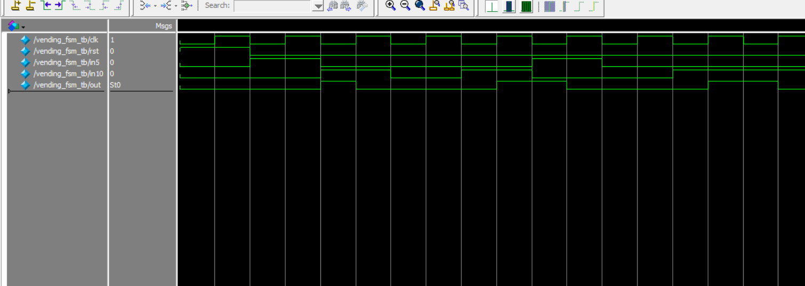

# 🥤 Verilog FSM - Vending Machine

This project implements a Finite State Machine (FSM) in Verilog to simulate a simple vending machine.  
It accepts 5 NT and 10 NT coins. When the total reaches **15 NT or more**, it outputs a drink (`out = 1`).

---

## 📁 Files Included

| File                     | Description                                    |
|--------------------------|------------------------------------------------|
| `vending_fsm.v`          | Verilog module implementing the FSM logic     |
| `vending_fsm_tb.v`       | Testbench for simulating the FSM behavior     |
| `vending_fsm.vcd`        | VCD waveform file for GTKWave / ModelSim      |
| `monitor_log.txt`        | Simulation output log (text)                  |
| `wave_vending_fsm_tb.png`| 📷 Waveform screenshot from ModelSim          |
| `RTL_vending_fsm.pdf`    | 📘 RTL schematic (generated by Quartus)       |

---

## 🧠 FSM Description

### 💰 Input Coins
- `in5 = 1`: Insert 5 NT
- `in10 = 1`: Insert 10 NT  
(*Only one input active at a time*)

### 🎯 Output
- `out = 1` when total coin ≥ 15 NT → vend a drink!

### 📈 State Transitions

| Current State | Input    | Next State | Output |
|---------------|----------|------------|--------|
| S0 (0 NT)     | in5      | S5         | 0      |
| S0            | in10     | S10        | 0      |
| S5 (5 NT)     | in5      | S10        | 0      |
| S5            | in10     | S0         | 1 ✅   |
| S10 (10 NT)   | in5      | S0         | 1 ✅   |
| S10           | in10     | S0         | 1 ✅   |

---

## 📷 Waveform

This waveform was captured in **ModelSim**, showing state transitions and output when inserting coins:

---

## 🧩 RTL Schematic

Generated in **Quartus**, this RTL (Register Transfer Level) diagram shows how the FSM logic is implemented in hardware:

[📘 View RTL FSM Diagram (PDF)](RTL_vending_fsm.pdf)

---

## 🔧 Tools Used

- **Quartus Prime** – RTL design & schematic generation  
- **ModelSim** – Simulation and waveform viewing  
- **Verilog HDL** – Hardware description language

---

## ✅ Example Tests

- Insert `5 ➜ 10` → out = 1
- Insert `10 ➜ 5` → out = 1
- Insert `10 ➜ 10` → out = 1
